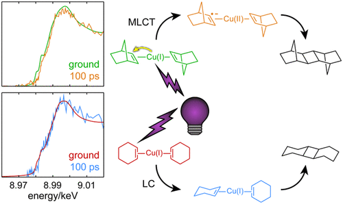
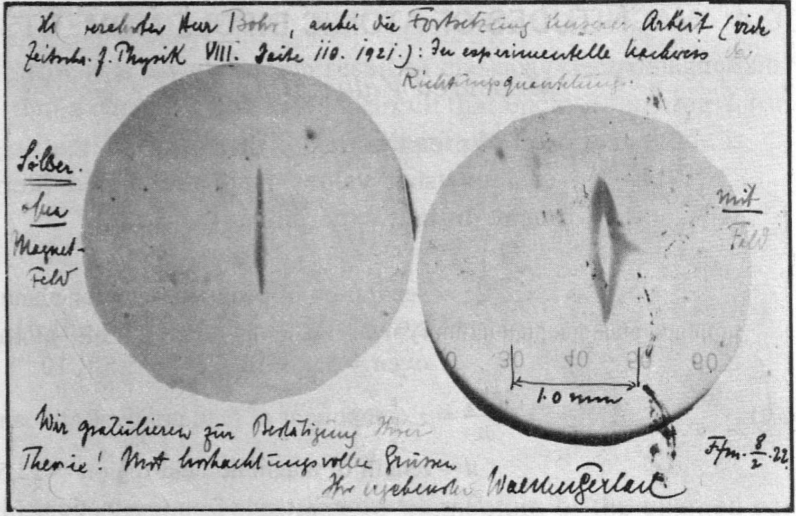
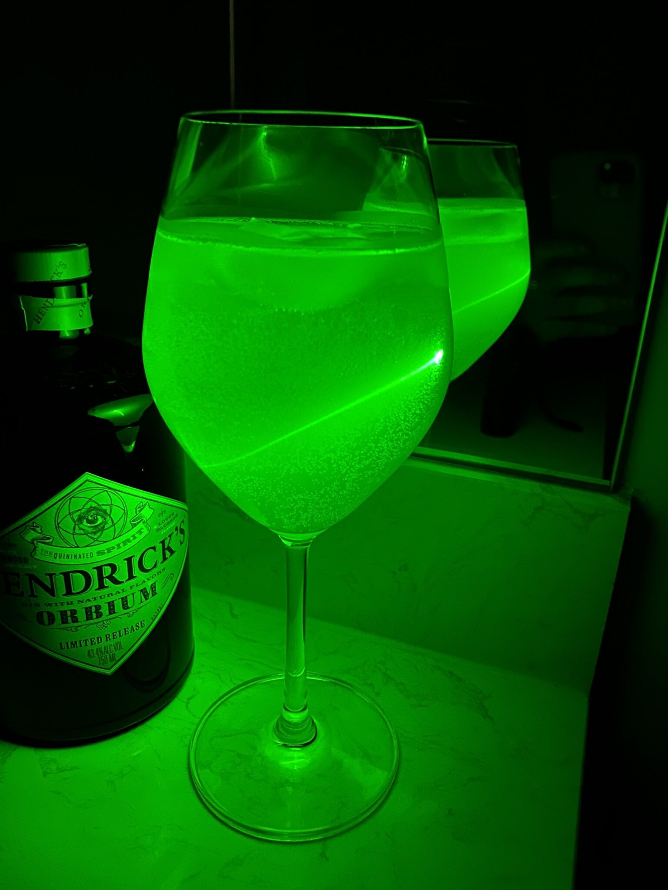
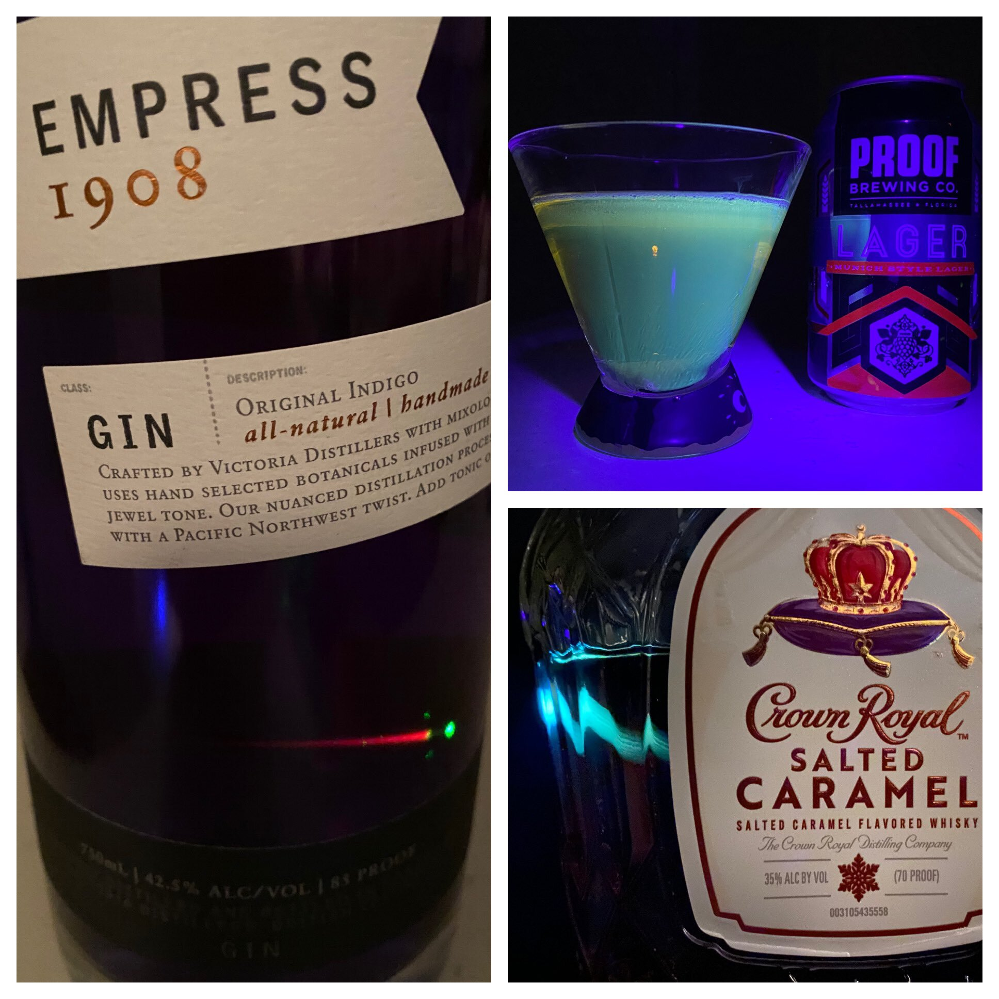

## Welcome to the Goeppert Mayer Gauge Podcast Webpage

You can use the [listen to the podcast here](https://www.buzzsprout.com/1442191), or subscribe on [Apple Podcasts](https://podcasts.apple.com/us/podcast/the-goeppert-mayer-gauge/id1537314272), [Spotify](https://open.spotify.com/show/7hh6eZ3TLxJFwuWnLAXM6L?si=qp-GQc4ZSXGgvbvyYtUi2w), and probably other places! 

We will use this page to post additional content, including simulations using [Jupyter Notebooks](https://jupyter.org/)

### [Episode 16: Thermal Radiation](https://www.buzzsprout.com/1442191/9682352-episode-15-photocycloaddition)
It's getting hot in here!  Dugan and Jay reunite to talk about thermal radiation, this time with Jay kasting from his new home - Charlotte North Carolina!
We talk about Planck's reluctant proposal of energy quantization, Jean cubes, radiative cooling, and more!

. 

### [Episode 15: Photocycloadditions](https://www.buzzsprout.com/1442191/9682352-episode-15-photocycloaddition)
We're celebrating Dugan's recent [JACS paper](https://pubs.acs.org/doi/10.1021/jacs.1c07282) on copper-catalyzed photocycloaddition reactions by doing a Back 2 Basics episode on photocycloadditons that is really just an episode on that paper with a little bit of Woodward Hoffmann rules thrown in for good measure. But what is a podcast for besides self-promotion anyway? We return to some of our favorite topics, including X-ray spectroscopy and transient absorption, and discuss how a combination of spectroscopic techniques can be used to deduce photochemical reaction mechanisms involving transition metals. We also ask ourselves how a single methylene group can drastically change the fate of a molecule and how a single pandemic can drastically change the fate of a research project.

 

### [Episode 14: The Stern-Gerlach Experiment](https://www.buzzsprout.com/1442191/9393244-episode-14-the-stern-gerlach-experiment)

This month is more Back 2 Basics as we discuss the famous Stern-Gerlach experiment. In addition to the classic version, we contemplate thought experiments, photonic analogs, spin pedagogy, cigar smoke, Nobel Prizes, interpretations of quantum mechanics, God, and approximately infinite universes. Did I miss anything?

 

- [Stern-Gerlach Lecture by Allan Adams](https://youtu.be/lZ3bPUKo5zc) Lecture starts at around 10 minute mark.  By the way this 804 series is fantastic, watch every video!
- [Jupyter Notebook simulating Stern-Gerlach type experiment on the rigid rotor system](https://github.com/FoleyLab/wpspec/blob/master/notebooks/stern-gerlach/demo_rigid-rotor_stern-gerlach.ipynb)
- [GitHub Arctic Code Project](https://youtu.be/fzI9FNjXQ0o)
- [ACS Symposium Series article on S-G type simulations in Physical Chemistry](https://pubs.acs.org/doi/abs/10.1021/bk-2021-1387.ch007)

### [Episode 13: Review of "Sit Resist" by Laura Stevenson](https://www.buzzsprout.com/1442191/9216794-episode-13-sit-resist)

New season, new format - we broadcast in-person from a hot tub in Atlanta during the Fall 2021 ACS Meeting!  We have been planning to review "Sit Resist" by Laura Stevenson basically since we started podcasting in Fall 2020, and we finally do in this episode.  And by "review" we really mean talk about how amazing this album is.  Content warning that this episode discusses dark subject matter, including physical abuse, substance abuse, and death; specific warnings are provided in the audio along with the duration of the content for listeners that would like to skip certain content.

 

- [Purchase Sit Resist on Bandcamp](https://laurastevenson.bandcamp.com/album/sit-resist-2)

### [Episode 12: Fluorescence Guided Surgery with Dr. Christie Lin](https://www.buzzsprout.com/1442191/8578938-episode-12-fluorescence-guided-surgery-with-dr-christie-lin)

In this episode, we talk about ways in which light-matter interactions are revolutionizing surgery.  We are joined by Christie Lin,  VP of Research at OnLume - a startup based in Madison WI dedicated to improving patient outcomes through innovations in Fluorescence Guided Surgery (FGS).  Christie prompts us to revisit some of our favorite topics, including SWIR fluorophores and gamma rays, and she also introduces us to regulatory policy for combination drug and medical devices!  The results of our first ever Twitter poll are announced,  and we finally answer a question that has been vexing us since Episode 1: How DO you focus a proton beam?  The answer might leave you speechless.

- [Ted Talk on FGS by Prof. Quyen Nguyen](https://youtu.be/-j2XrT0QN5A)

### [Episode 11: Statistical Mechanics with Prof. Katja Lindenberg](https://www.buzzsprout.com/1442191/8494742-episode-11-statistical-mechanics-with-prof-katja-lindenberg)

We're unbelievably honored and excited to have the legendary Prof. Katja Lindenberg on the show to take us through her life in physics and physical chemistry. We talk to Prof. Lindenberg about her early life and education, her transition from mathematics to physics, and of course her incredible 50 year career at UCSD, during which she used "the language of science" (statistical mechanics) to describe problems involving random processes in nearly every discipline you could possibly imagine. We also get to hear a few stories about some of her first friends and mentors at UCSD, Maria Goeppert Mayer and her husband Joe Mayer!

- [Video in honor of Prof. Katja Lindenberg's receipt of the 2020 Revelle Medal](https://youtu.be/lCT9alFbR2o)
- [Lecture on synchronization and other collective phenomena by Prof. Lindenberg](https://youtu.be/OgUlDLp4-nY)

### [Episode 10: Perovskites and photon upconversion with Prof. Lea Nienhaus](https://www.buzzsprout.com/1442191/8393794-episode-10-perovskites-and-photon-upconversion-with-prof-lea-nienhaus)

We are joined by [Prof. Lea Nienhaus](https://www.chem.fsu.edu/~nienhaus/) from Florida State University to learn about photon upconversion with perosvkites, a strategy for increasing the efficiency of photovoltaic energy conversion among other applications that her group has pioneered in the last few years.  We also talk to Lea about her science communication project, "Kitchen Spectroscopy", that she launched at the beginning of the COVID-19 pandemic that empowers people to discover the plethora of ["glowy things"](https://www.chem.fsu.edu/~nienhaus/kitchenspec.html) that can be found at home.  Transition music in the episode is courtesy of [Prof. Nate DeYonker's](https://www.memphis.edu/chem/faculty-deyonker/) [Noiserpuss](https://noiserpuss.bandcamp.com/) project!

- [Review article on photon upconversion with perovskites](https://pubs.rsc.org/kz/content/articlelanding/2021/tc/d1tc00245g/unauth#!divAbstract)
- [Matter article discussing Lea's Kitchen Spectroscopy outreach](https://doi.org/10.1016/j.matt.2020.04.026)
- ["Bright and loud in the age of darkness" by Noiserpuss](https://noiserpuss.bandcamp.com/album/bright-and-loud-in-an-age-of-darkness)

 

### [Episode 9: Optical Transient Absorption Spectroscopy](https://www.buzzsprout.com/1442191/8304070-episode-9-transient-absorption)

- [Review on Ultrafast Transient Absorption Spectroscopy](https://link.springer.com/article/10.1007/s11120-009-9454-y)
- [Video tutorial on photochemical studies with Transient Absorption](https://youtu.be/LlVhMgl6Z_U)
- [Transient Absorption Explained Video](https://youtu.be/RFFfYlq3oEo)
- [A Rilo Kiley Playlist for Dugan](https://open.spotify.com/playlist/2FlW9jFMge0rmgkpDa3M5x?si=iNC4KD7FS6-EBsTIb1Tv1Q)

### [Episode 8: Interview with Jeamme Chia about Maria Goeppert Mayer](https://www.buzzsprout.com/1442191/7573144-episode-8-interview-with-jeamme-chia-on-maria-goeppert-mayer)

[Jeamme Chia](https://www.linkedin.com/in/jeammechia/), who did original research on Maria Goeppert Mayer, joins us to talk about our namesake at a particularly formative time in her career.  Maria Goeppert Mayer's first paid faculty position was at Sarah Lawrence College, and it was during her time at Sarah Lawrence College that she was recruited to work on the Manhattan Project in the Substitute Alloy Materials Lab.  We talk with Jeamme about the Sarah Lawrence system, about how Maria Goeppert Mayer changed science education there, and about many other things!  

Some companion readings for this episode: 

- [Sarah Lawrence College's Maria Goeppert Mayer exhibit](https://www.sarahlawrence.edu/archives/exhibits/maria-goeppert-mayer-exhibit/)

<!--- [Jeamme's paper from her time at Sarah Lawrence College](https://github.com/FoleyLab/gmgauge/blob/main/docs/Chia_Maria%20Goeppert%20Mayer%20-%20Revisiting%20Science%20at%20Sarah%20Lawrence%20-%20March%202012%20edit.pdf) --->

- ["Beyond Curie" by Scott Calvin](https://iopscience.iop.org/book/978-1-6817-4645-6)

- [Personal memoir of Peter Mayer about Maria and Joe](https://www.amazon.com/Son-Entropy-Personal-Memories-Physicist/dp/1463420692)

You can read more about Jeamme's current work on environmental policy, with a particular focus on the relocation of Indonesia's capitol, [here!](https://tri.yale.edu/people/jeamme-chia)

### [Episode 7: 2020 Recap](https://open.spotify.com/show/7hh6eZ3TLxJFwuWnLAXM6L?si=qp-GQc4ZSXGgvbvyYtUi2w)

What better way to celebrate the end of 2020 than by talking about it for 80 minutes? We take a break from science talk and (mostly) leave aside the bad stuff from the year to focus on what music, TV, podcasts, and youtube channels kept us sane during lockdown. We also contemplate the future of in-person conferences and get excited for the Goeppert Mayer Gauge in 2021. 

Be sure to check out the accompanying [Spotify playlist!](https://open.spotify.com/playlist/6DzfdEzW8m7HDjy18bGPi8?si=rgElSTJLTDSIcRhPx4UAJw)

And also, these were the YouTube series and videos that got us through 2020:

- [Polaritonic Chemistry Webinar Series](https://www.youtube.com/channel/UC3MCkwsb8v4HldW1tI6U56w)

- [Global XAS Journal Club](https://www.youtube.com/channel/UCwtkyiTV4BltKTQ7tS0CltQ)

- [The Wren's live at Vintage Vinyl](https://www.youtube.com/watch?v=IVhtnCNZgAk)

- [Puff Daddy's All about the Benjamins](https://www.youtube.com/watch?v=PaEMpAlppNE)

- [All about the Benjamins (Shot-Caller Rock Remix)](https://www.youtube.com/watch?v=S-zFxG49Sms)

- [Sam Vaknin's YouTube channel](https://www.youtube.com/user/samvaknin/videos)

- [Souped Up Recipes](https://www.youtube.com/c/SoupedUpRecipes/videos)

- [The Planet Cast with KC and Elka](https://youtube.com/playlist?list=PLbdgGGWYAw2ZgC79h9wdahWBnHnWYOfKq)

### [Epsiode 6: Surface Plasmon Resonance Biosensors](https://open.spotify.com/episode/03gFQCXfUhq998t9eUhTFb?si=7aMXBQkAS3C32a40YGEkZw)

- [Simulating the sensitivity of an SPR-based biosensor](https://github.com/FoleyLab/gmgauge/blob/main/Goeppert_Mayer_Gauge_Episode_6.ipynb)

A schematic of an SPR biosensor from [Bruker](https://www.bruker.com/products/surface-plasmon-resonance.html):

A paper describing a dual-function plasmonic sensor for COVID-19 detection can be found [here!](images/acsnano.0c02439.pdf)

- There is also a [Companion Spotify Playlist!](https://open.spotify.com/playlist/5dqmMKMRwXeZzMAvkRLzWF?si=LpewxzmXR6-KmbZvB4da1w)

### [Epsiode 5: SWIR with Prof. Justin Caram](https://open.spotify.com/episode/03gFQCXfUhq998t9eUhTFb?si=7aMXBQkAS3C32a40YGEkZw)

- [Establishing Design Principles for Emissive Organic SWIR Chromophores from Energy Gap Laws](https://chemrxiv.org/articles/preprint/Establishing_Design_Principles_for_Emissive_Organic_SWIR_Chromophores_from_Energy_Gap_Laws/14374493)

- [Scaling relationships from the Particle in a Box](https://github.com/FoleyLab/gmgauge/blob/main/Goeppert_Mayer_Gauge_Episode_5.ipynb)

Some images SWIR thermal emission detected by an iPhone camera are shown below.  To the eye, these objects look orange in color and are somewhat dim; in
the iPhone camera image, they are bright and look almost pink in color.

. 

As Justin explains in the episode, the silicon-based iPhone camera detects into the SWIR, but has a filter that blocks
the relatively small amount of SWIR radiation normally emitted at ambient temperatures.  However, the blackbody emission from objects
as hot as a charcoal chimney or a propane heater (>500 degrees celcius) is strong enough in the SWIR to be detected by 
the iPhone camera even with filtration.

- There is also a [Companion Spotify Playlist!](https://open.spotify.com/playlist/6vfh4EnglzJrsF4pTnRu2T?si=vAXV00BDTvKsTsYU4Nuwvg)

### [Epsiode 4: THz](https://open.spotify.com/episode/5pEd3YeUCuLn76USuaZg6s?si=8k1gSQ8fSHm_T1eTwOcIqg)

- [Thermal Radiation of THz Photons and more](https://github.com/FoleyLab/gmgauge/blob/main/Goeppert_Mayer_Gauge_Episode_4.ipynb)

- There is also a [Companion Spotify Playlist!](https://open.spotify.com/playlist/3mLENkw6EutEXHM3YHTY3k?si=LIkd3KeGTcmoOzORR6Lxww) 

